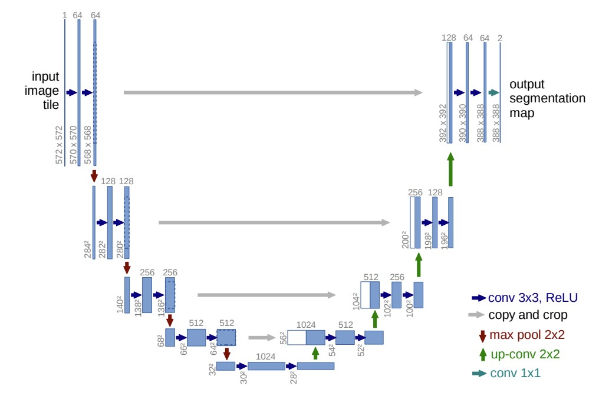
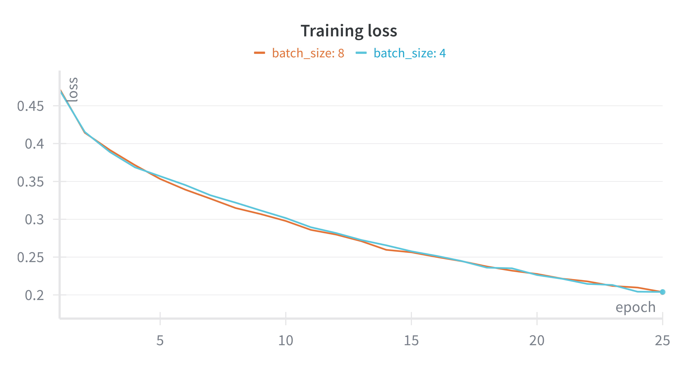
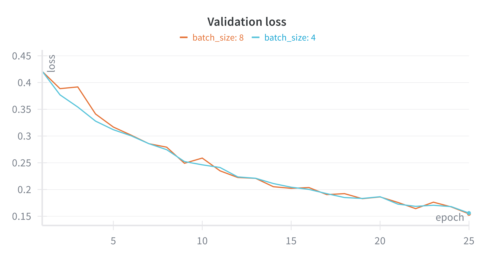
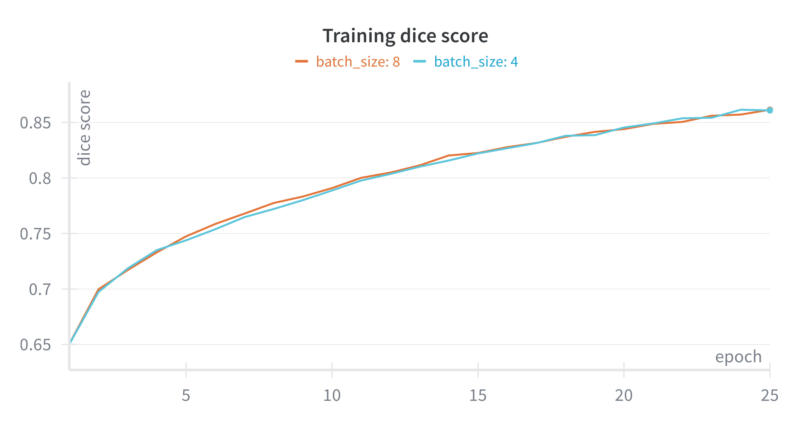
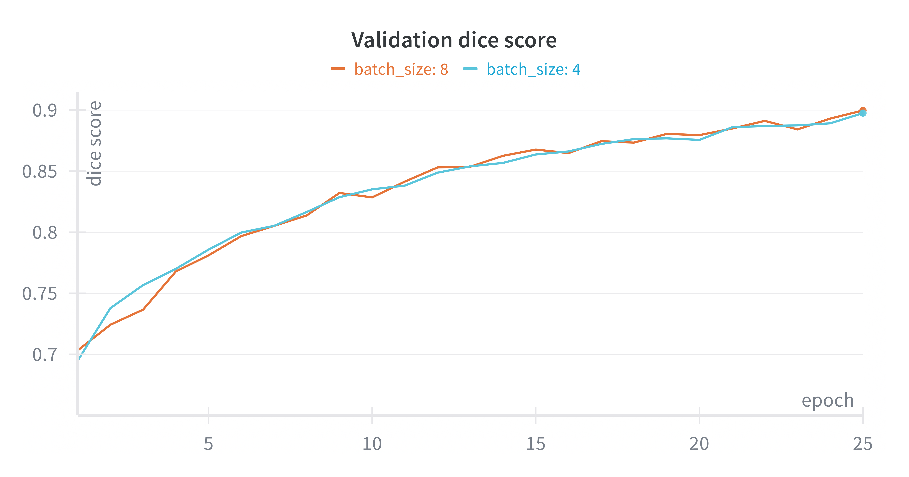
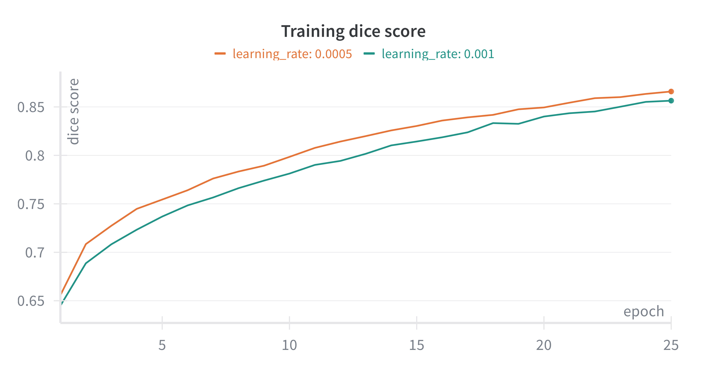
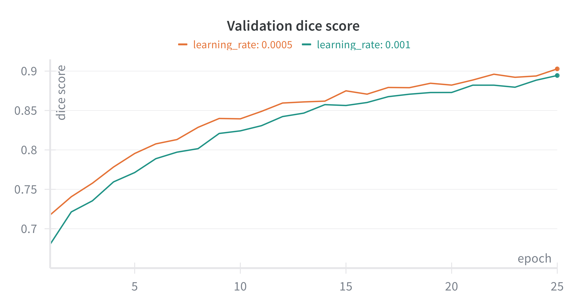
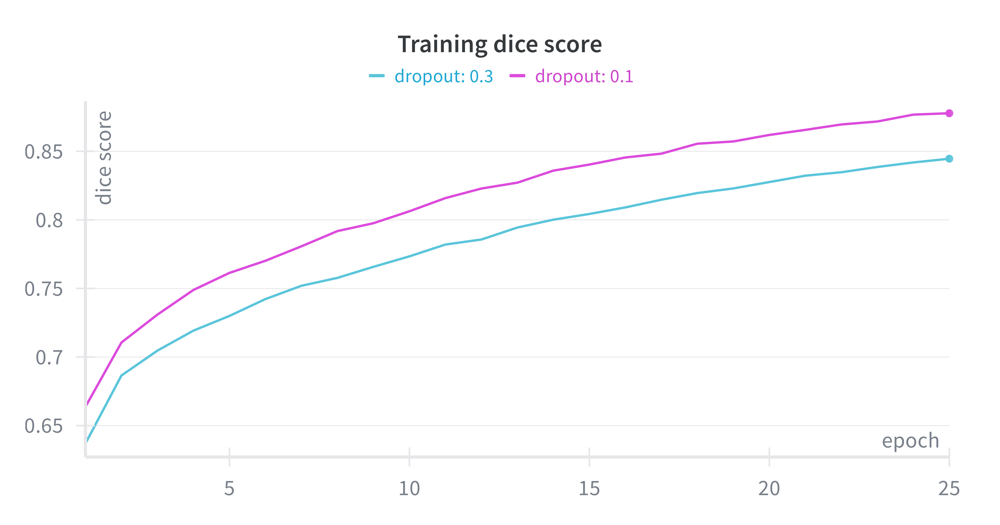
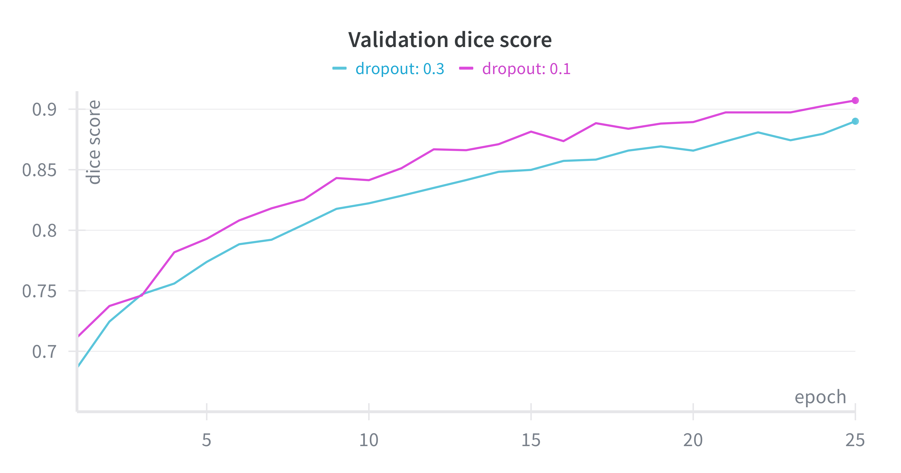

# U-Net Image Segmentation

A complete end-to-end implementation of the U-Net architecture for binary image segmentation, built in PyTorch. Trained on a Kaggle person segmentation dataset, the model achieves a **Dice score of 0.942** on the validation set and **0.915** on the Kaggle public leaderboard.

<div align="center">
  
</div>

---

## Overview

Image segmentation is the task of classifying every pixel of an image into a semantic category. Unlike object detection, which draws bounding boxes, segmentation produces a precise pixel-level mask — enabling applications in medical imaging, satellite analysis, robotics, and more.

This project implements U-Net from scratch following the original paper by Ronneberger et al. (2015), with targeted architectural improvements: Batch Normalization, Dropout, a combined BCE + Dice loss function, and a learning rate scheduler. A Weights & Biases hyperparameter sweep was used to identify the optimal training configuration.

---

## Motivation

U-Net was introduced in 2015 and rapidly became the standard architecture for biomedical image segmentation. Its key innovation — **skip connections** between the encoder and decoder — allows the network to combine global context with fine-grained spatial detail, achieving strong results even with limited labeled data.

Since then, U-Net has been the foundation for numerous variants (U-Net++, Attention U-Net, nnU-Net) and remains highly relevant across domains. This project implements the architecture from scratch to build a thorough understanding of its internals and to serve as a reproducible baseline for segmentation tasks.

---

## Dataset

The dataset is sourced from a Kaggle person segmentation competition. It consists of RGB images (800×800 pixels) paired with binary masks indicating the location of human figures.

| Split | Size |
|---|---|
| Training | ~80% of labeled data |
| Validation | ~20% of labeled data |
| Test | Unlabeled (Kaggle submission) |

**To obtain the data:** download the dataset from the Kaggle competition page and place the files under `data/` following the structure:

```
data/
├── train/
│   ├── images/
│   └── masks/
└── test/
    └── images/
```

---

## Methodology

### Preprocessing and Data Augmentation

All images are resized to **256×256** pixels before being fed to the network. The resize value was chosen to balance memory usage and spatial resolution. Pixel values are normalized to [0, 1].

Data augmentation is applied exclusively to the training set:

| Transform | Purpose |
|---|---|
| Random Horizontal Flip | Improves generalization; preserves semantic content |
| Random Rotation (±15°) | Handles non-upright poses |
| ColorJitter | Reduces sensitivity to lighting and color variation |

### Loss Function

Training uses a **combined loss (ComboLoss)**:

$$\mathcal{L} = 0.25 \cdot \text{BCE} + 0.75 \cdot \text{DiceLoss}$$

- **BCE** provides numerically stable gradients throughout training.
- **Dice Loss** directly optimizes the evaluation metric, improving mask overlap.

### Optimizer and Scheduler

- **Optimizer:** Adam (`lr=0.0005`)
- **Scheduler:** ReduceLROnPlateau — halves the learning rate after 3 consecutive epochs without improvement in the validation Dice score.
- **Early Stopping:** patience of 15 epochs; training stopped at epoch 85.

---

## Model Architecture

The U-Net is composed of three types of reusable building blocks:

**`DoubleConv`** — the fundamental unit: two consecutive `Conv2d → BatchNorm → ReLU` operations. `padding=1` preserves spatial resolution. Dropout is applied between the two convolutions as regularization.

**`Down`** — one encoder step: `DoubleConv` followed by `MaxPool2d(2)` to halve the spatial resolution. Returns both the pre-pooling features (skip connection) and the downsampled features.

**`Up`** — one decoder step: `ConvTranspose2d` to double resolution (upsampling), concatenation with the corresponding skip connection, then `DoubleConv` to fuse the combined features.

```
Input (3×256×256)
    │
    ├── Down(64)   ──────────────────────────────────────┐ skip
    ├── Down(128)  ────────────────────────────────┐ skip │
    ├── Down(256)  ──────────────────────────┐ skip │     │
    ├── Down(512)  ────────────────────┐ skip │     │     │
    │                                  │      │     │     │
    └── Bottleneck(1024)               │      │     │     │
                                       │      │     │     │
    ┌── Up(512) ◄───────────────────── ┘      │     │     │
    ├── Up(256) ◄──────────────────────────── ┘     │     │
    ├── Up(128) ◄────────────────────────────────── ┘     │
    └── Up(64)  ◄──────────────────────────────────────── ┘
         │
    Conv1x1 → Output (1×256×256)
```

**Improvements over the original paper:**
- Batch Normalization after each convolution (stabilizes training)
- Dropout between convolutions (reduces overfitting)
- `padding=1` throughout (eliminates the need for border cropping at skip connections)

---

## Results

| Metric | Value |
|---|---|
| Validation Dice Score | **0.942** |
| Kaggle Public Leaderboard | **0.915** |
| Training stopped at epoch | 85 / 200 |
| Optimal binarization threshold | 0.55 |

Training and validation curves confirm convergence without significant overfitting:

<div align="center">
  
  
</div>

The model performs best on images where a human figure is clear and occupies a substantial portion of the frame. The main failure mode is the detection of small or distant persons.

---

## Experiments & Ablations

A Weights & Biases sweep was run over 8 configurations (25 epochs each, early stopping with patience=5) varying three hyperparameters:

### Batch Size (4 vs. 8)

| Batch Size | Avg. Val. Dice | Training Time |
|---|---|---|
| 4 | ≈ equal | Slower |
| **8** | ≈ equal | **Faster** ✓ |

Both sizes yield nearly identical performance; batch size 8 was selected for efficiency.

<div align="center">
  
  
</div>

### Learning Rate (0.001 vs. 0.0005)

| Learning Rate | Avg. Val. Dice |
|---|---|
| 0.001 | Lower |
| **0.0005** | **Higher** ✓ |

A consistent advantage in favor of `lr=0.0005` across all metrics.

<div align="center">
  
  
</div>

### Dropout (0.1 vs. 0.3)

| Dropout | Avg. Val. Dice |
|---|---|
| 0.3 | Noticeably lower |
| **0.1** | **Best results** ✓ |

Higher dropout hurts performance at this scale — lighter regularization was sufficient.

<div align="center">
  
  
</div>

**Optimal configuration:** `lr=0.0005`, `batch_size=8`, `dropout=0.1`

---

## How to Run

### 1. Clone the repository

```bash
git clone https://github.com/brunodinello/net-image-segmentation.git
cd net-image-segmentation
```

### 2. Set up the environment

```bash
conda create -n unet-segmentation python=3.10
conda activate unet-segmentation
pip install -r requirements.txt
```

### 3. Prepare the data

Download the dataset from Kaggle and place it under `data/` as described in the [Dataset](#dataset) section.

### 4. Run the notebook

```bash
jupyter notebook notebooks/01_training_unet.ipynb
```

Execute cells sequentially. The notebook covers the full pipeline: data exploration → model definition → training → evaluation → Kaggle submission generation.

---

## Requirements

Key dependencies (see `requirements.txt` for pinned versions):

| Package | Version |
|---|---|
| torch | 2.3.1 |
| torchvision | 0.18.1 |
| numpy | 1.26.4 |
| wandb | 0.17.0 |
| scikit-learn | 1.5.0 |

---

## Limitations & Future Work

- **Input resolution:** resizing to 256×256 discards fine detail, which contributes to the main failure mode (small/distant persons). Increasing to 512×512 would likely improve results at the cost of higher memory and training time.
- **Single-class segmentation:** the current setup is binary (person vs. background). Extending to multi-class segmentation would require changes to the loss function and output layer.
- **Data augmentation:** additional strategies such as elastic deformation (used in the original U-Net paper for biomedical data) or MixUp could further improve generalization.
- **Architecture variants:** exploring Attention U-Net or U-Net++ could yield improvements on challenging cases.

---

## References

- Ronneberger, O., Fischer, P., & Brox, T. (2015). [U-Net: Convolutional Networks for Biomedical Image Segmentation](https://arxiv.org/abs/1505.04597). *MICCAI 2015*.
- Sudre, C. H., et al. (2017). [Generalised Dice overlap as a deep learning loss function for highly unbalanced segmentations](https://arxiv.org/abs/1707.03237).
- Weights & Biases: [wandb.ai](https://wandb.ai)

---

## Author

**Bruno Dinello · Carlos Dutra · Lorenzo Foderé**  
Machine Learning & Data Science — ORT Uruguay University  
[](https://www.linkedin.com/in/bruno-dinello)
[](https://github.com/brunodinello)
